<p align="center">
  
</p>

<h1 align="center">🌱 EcoBridge Enterprise</h1>

<p align="center">
A Cloud-Native Waste Management Platform built using a scalable Microservices Architecture.
</p>

<p align="center">
  
  
  
  
  
  
  
  
  
</p>

# EcoBridge Enterprise

EcoBridge Enterprise is a cloud-native waste management and recycling coordination platform that connects waste generators with recyclers through location-aware matching, recycler discovery, waste management, and pickup coordination.

The system is built as a Spring Boot microservices application with a React frontend and demonstrates modern backend, distributed-systems, and DevOps practices.

---

## 🌍 What is EcoBridge?

EcoBridge helps users manage the complete recycling workflow:

```
                     User
                       │
                       ▼
              React Frontend
                       │
                       ▼
                 API Gateway
                       │
         ┌─────────────┼─────────────┐
         │             │             │
         ▼             ▼             ▼
    Authentication   Waste       Recycler
      & Users       Management   Management
         │             │             │
         └─────────────┼─────────────┘
                       │
                       ▼
                Matching Service
                       │
          ┌────────────┼────────────┐
          │            │            │
          ▼            ▼            ▼
     EcoBridge      Google       OpenStreetMap
     Recyclers      Places        / Overpass
          │            │            │
          └────────────┼────────────┘
                       │
                       ▼
              Recycler Comparison
                       │
                       ▼
                Interactive Map
                       │
                       ▼
                Reserve Waste
                       │
                       ▼
                    Pickup
                       │
                       ▼
               Complete Pickup
                       │
              ┌────────┴────────┐
              ▼                 ▼
          Analytics       Notifications
```

---

## 🚀 Live Deployment

| Component | URL |
|---|---|
| 🌐 Frontend | https://ebe-mauve.vercel.app |
| 🚪 API Gateway | https://ecobridge-enterprise-0.onrender.com |
| 🔐 Auth Service | https://ecobridge-enterprise-2.onrender.com |
| ♻️ Waste Service | https://ecobridge-enterprise-3.onrender.com |
| 🏭 Recycler Service | https://ecobridge-enterprise-4.onrender.com |
| 🔔 Notification Service | https://ecobridge-enterprise-5.onrender.com |
| 🎯 Matching Service | https://ecobridge-enterprise-6.onrender.com |
| 📊 Analytics Service | https://ecobridge-enterprise-7.onrender.com |

The frontend is deployed on **Vercel**, while the backend microservices are deployed independently on **Render**.

---

## 🎥 Demo Videos

- 🏠 **Complete Homepage & Analytics Dashboard** — https://youtu.be/3vPZGw2ThH0
- ♻️ **Waste Generator Dashboard** — https://youtu.be/UOhaup6RQDA
- 🏭 **Recycler Dashboard** — https://youtu.be/2-SqnhixZyE
- 🐳 **Docker Desktop & Kubernetes** — https://youtu.be/r1P_vWOkgxM

---

## 🏗 System Architecture

```
                     Users
                       │
                       ▼
              React Frontend
                  (Vercel)
                       │
                       ▼
                API Gateway
                   :8080
                       │
      ┌────────────────┼────────────────┐
      │                │                │
      ▼                ▼                ▼
 Auth Service     Waste Service    Recycler Service
    :8081             :8084             :8085
      │                │                │
      └────────────────┼────────────────┘
                       │
                       ▼
                Matching Service
                    :8086
                       │
          ┌────────────┼────────────┐
          │            │            │
          ▼            ▼            ▼
    EcoBridge       Google        OpenStreetMap
     Recyclers      Places         Overpass
          │            │            │
          └────────────┼────────────┘
                       │
                       ▼
              Recycler Comparison
                       │
                       ▼
                Google Maps
                       │
          ┌────────────┼────────────┐
          │            │            │
          ▼            ▼            ▼
      Waste       EcoBridge      Public
     Location      Recyclers     Businesses
                       │
                       ▼
             Analytics / Notification
                       │
                       ▼
             PostgreSQL / Redis / Kafka
```

---

## 🔄 Complete System Workflow

```
                     Generator
                         │
                         ▼
                   Login / OAuth2
                         │
                         ▼
                   Create Waste
                         │
                         ▼
                Waste Service
                         │
                         ▼
                Waste Location
                         │
                         ▼
               Matching Service
                         │
      ┌──────────────────┼──────────────────┐
      │                  │                  │
      ▼                  ▼                  ▼
Registered           Google Places       OpenStreetMap
EcoBridge            Nearby Search         / Overpass
Recyclers                  │                  │
      │                   │                  │
      └───────────────────┼──────────────────┘
                          │
                          ▼
                Combined Recycler Data
                          │
                          ▼
                Recycler Recommendation
                          │
                          ▼
                Recycler Comparison
                          │
                          ▼
                  Interactive Map
                          │
           ┌──────────────┼──────────────┐
           │              │              │
           ▼              ▼              ▼
        Navigate       Website        Details
           │              │              │
           └──────────────┼──────────────┘
                          │
                          ▼
                    Reserve Waste
                          │
                          ▼
                       Pickup
                          │
                          ▼
                   Complete Pickup
                          │
                ┌─────────┴─────────┐
                ▼                   ▼
            Analytics          Notification
```

---

## 🎯 Recycler Discovery Architecture

EcoBridge does not depend only on recyclers registered inside the platform. The matching system combines multiple sources to provide a broader discovery experience.

```
                   Matching Service
                          │
         ┌────────────────┼────────────────┐
         │                │                │
         ▼                ▼                ▼
   EcoBridge          Google Places     OpenStreetMap
   Recycler DB        Nearby Search       Overpass
         │                │                │
         ▼                ▼                ▼
   Registered        Google-listed      Public
    Recyclers         Businesses        Locations
         │                │                │
         └────────────────┼────────────────┘
                          │
                          ▼
               Combined Recycler Results
                          │
                          ▼
                Generator Comparison
                          │
                          ▼
                   Google Maps
```

---

## 🗺️ Google Maps Integration

Google Maps is used to provide an interactive geographical view of waste and recycler locations. The map can display:

```
                Google Maps
                     │
    ┌────────────────┼────────────────┐
    │                │                │
    ▼                ▼                ▼
Waste Location   EcoBridge Recycler  Google Business
   🔴                 🟢                 🟠
    │                │                │
    └────────────────┼────────────────┘
                     │
                     ▼
              Recycler Details
                     │
          ┌──────────┴──────────┐
          │                     │
          ▼                     ▼
       Website              Navigate
                                │
                                ▼
                      Google Maps Directions
```

The map provides:

- Waste location
- EcoBridge registered recyclers
- Google-listed recycling-related businesses
- Recycler coordinates
- Address information
- Distance information where available
- Recycler website where available
- Google Maps navigation
- Interactive marker information

---

## 🔎 Google Places Discovery

Google Places Nearby Search is used to discover businesses around the waste location that are listed on Google but are not necessarily registered with EcoBridge.

The frontend requests nearby places based on the waste coordinates and a configurable search radius.

The returned information can include:

- Business name
- Address
- Latitude
- Longitude
- Google Maps URI
- Website
- Place type
- Place ID

These businesses are represented separately from EcoBridge's registered recyclers.

---

## 🌐 Public Recycler Discovery

EcoBridge also supports public location discovery through OpenStreetMap / Overpass data. This provides another source of recycling-related locations that may not exist in the EcoBridge database or Google Places results.

```
               Waste Coordinates
                       │
                       ▼
                Matching Service
                       │
                       ▼
                 Public Search
                       │
                ┌──────┴──────┐
                │             │
                ▼             ▼
             Google         OSM
             Places       Overpass
                │             │
                └──────┬──────┘
                       │
                       ▼
              Public Locations
                       │
                       ▼
                 Map / Table
```

---

## ♻️ Recycler Management

Recycler accounts support:

- Recycler registration
- Recycler name
- Company name
- Email
- Phone
- Address
- Latitude
- Longitude
- Recycler type
- Accepted waste types
- Service radius
- Total capacity
- Available capacity
- Verification status
- Recycler status
- Recycler profile
- Recycler dashboard
- Pickup management

**Supported recycler types:**
- INDIVIDUAL
- COMPANY

**Supported waste types:**
- PLASTIC
- PAPER
- METAL
- GLASS
- ORGANIC
- EWASTE
- TEXTILE

---

## ♻️ Waste Management

Generators can:

- Create waste listings
- Add waste descriptions
- Add waste type
- Add quantity
- Add pickup location
- Add waste images
- View their waste
- Edit waste
- Delete waste
- Browse waste
- View waste details
- Track waste status
- Reserve waste
- Manage pickups
- Complete pickups
- View pickup history

---

## 🔐 Authentication & Security

EcoBridge implements secure authentication using Spring Security and JWT.

```
                   User
                     │
                     ▼
              Login / OAuth2
                     │
          ┌──────────┴──────────┐
          │                     │
          ▼                     ▼
      Email Login        Google / GitHub
          │                     │
          └──────────┬──────────┘
                     ▼
                Auth Service
                     │
                     ▼
                JWT Token
                     │
                     ▼
              Protected APIs
                     │
                     ▼
            Role-Based Access
```

Supported authentication:

- JWT authentication
- Google OAuth2
- GitHub OAuth2
- Role-based authorization
- Protected API routes
- Stateless sessions
- Access token based API communication

---

## 👥 User Roles

### Generator

Generators can:
- Create waste
- Manage waste
- Browse recyclers
- Compare recyclers
- View recycler locations
- Navigate to recyclers
- Reserve waste
- Track pickups
- View notifications
- View analytics

### Recycler

Recyclers can:
- Register their recycling profile
- Configure accepted waste types
- Configure capacity
- Browse available waste
- View waste details
- Reserve waste
- Manage pickups
- Complete pickups
- View pickup history
- Manage their profile

---

## 📊 Analytics

The Analytics Service provides system-level analytics and dashboard information. The platform can track information related to:

- Waste activity
- Pickup activity
- Recycler activity
- Completed operations
- Platform usage

Analytics functionality is isolated into its own microservice so that it can evolve independently from the core waste and recycler services.

---

## 🔔 Notification Service

The Notification Service handles application notifications and is separated from the core business services. This architecture allows notification functionality to evolve independently and supports event-driven communication through Kafka.

```
          Application Event
                 │
                 ▼
              Kafka
                 │
                 ▼
      Notification Service
                 │
                 ▼
            User Alert
```

---

## ⚡ Redis Caching

Redis is used as the caching layer for frequently accessed or computationally expensive data.

```
         Application Request
                 │
                 ▼
               Redis
            ┌────┴────┐
            │         │
          HIT        MISS
            │         │
            ▼         ▼
         Return    Service / DB
                      │
                      ▼
                    Redis
```

Caching helps reduce unnecessary database or service calls.

---

## 📨 Kafka Event Streaming

Kafka provides event-driven communication between services.

```
              Service Event
                   │
                   ▼
                 Kafka
                   │
      ┌────────────┼────────────┐
      │            │            │
      ▼            ▼            ▼
 Notification   Analytics    Other Services
```

This helps keep asynchronous processing separated from synchronous request flows.

---

## 📖 Documentation

The project documentation is organized into dedicated guides covering the
architecture, APIs, deployment, observability and external map integrations.

| Document | Description |
|---|---|
| 📐 [Architecture](docs/architecture.md) | Overall microservices architecture and service interactions |
| 🔄 [System Workflow](docs/architecture.md) | Complete EcoBridge request and matching workflow |
| 🔌 [API Reference](docs/api.md) | REST API endpoints and service interfaces |
| 📘 [Swagger Guide](docs/swagger.md) | Interactive Swagger/OpenAPI documentation for each service |
| 🚀 [Deployment Guide](docs/deployment.md) | Docker, Kubernetes, Render and deployment configuration |
| 📊 [Observability](docs/observability.md) | Prometheus, Grafana, Actuator and application monitoring |
| 🗺️ [Maps & Recycler Discovery](docs/maps.md) | Google Maps, Google Places and OpenStreetMap-based recycler discovery |

## 📘 Interactive API Documentation

The backend services expose REST APIs built with Spring Boot. Swagger/OpenAPI
documentation is available for the individual microservices, allowing
developers to inspect endpoints, request models, responses and test APIs.

➡️ **[View Swagger Documentation](docs/swagger.md)**

---

## ✨ Complete Feature List

**Authentication**
- JWT Authentication
- Google OAuth2
- GitHub OAuth2
- Role-Based Authorization
- Protected Routes

**Waste**
- Create Waste
- Edit Waste
- Delete Waste
- Waste Details
- Waste Image
- Waste Status
- Browse Waste
- Reserve Waste
- Pickup Management
- Pickup History

**Recycler**
- Recycler Registration
- Recycler Profile
- Recycler Dashboard
- Recycler Details
- Recycler Capacity
- Accepted Waste Types
- Service Radius
- Recycler Verification
- Recycler Status

**Matching**
- Location-based matching
- Waste-type matching
- Capacity-aware matching
- Distance-based recommendations
- Recycler ranking
- Nearby recycler discovery

**Maps**
- Google Maps
- Google Places Nearby Search
- Google-listed businesses
- OpenStreetMap
- Overpass API
- Waste location markers
- Recycler markers
- Navigation
- Website links
- Interactive map

**Backend**
- API Gateway
- Config Server
- Eureka Service Discovery
- OpenFeign
- PostgreSQL
- Redis
- Kafka

**DevOps**
- Docker
- Docker Compose
- Kubernetes
- GitHub Actions
- Render
- Vercel
- Prometheus
- Grafana

---

# 📷 Frontend Gallery

The EcoBridge frontend provides dedicated experiences for public users, waste generators and recyclers.

### 🌐 Public Pages

| Home | Login | Register |
|---|---|---|
|  |  |  |

### 🏠 Homepage

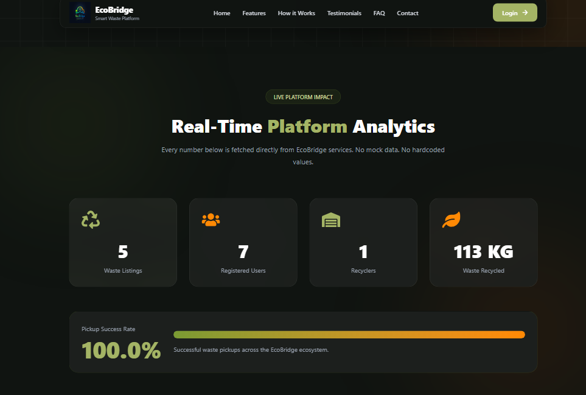

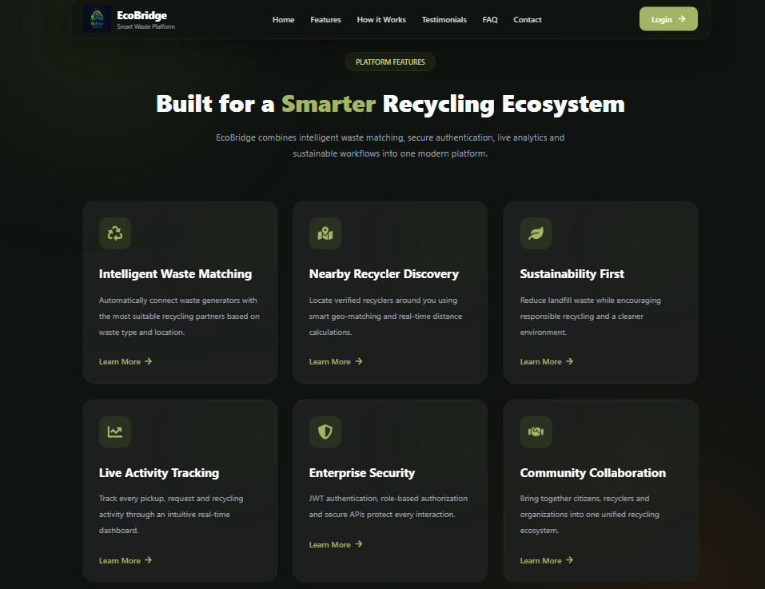

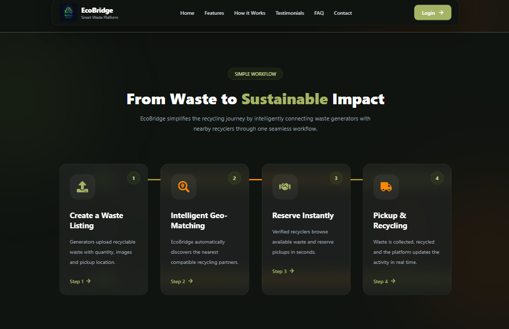

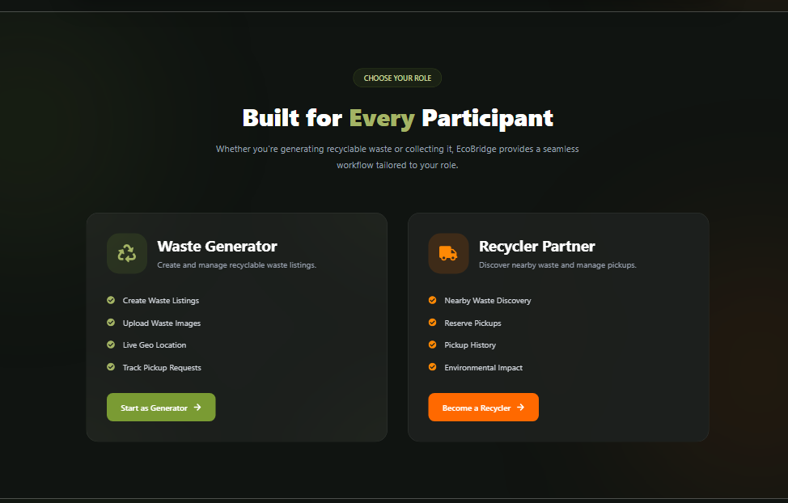

### 👤 Generator Experience

| Dashboard | Create Waste |
|---|---|
|  |  |

| My Waste | Compare Recycler |
|---|---|
|  | 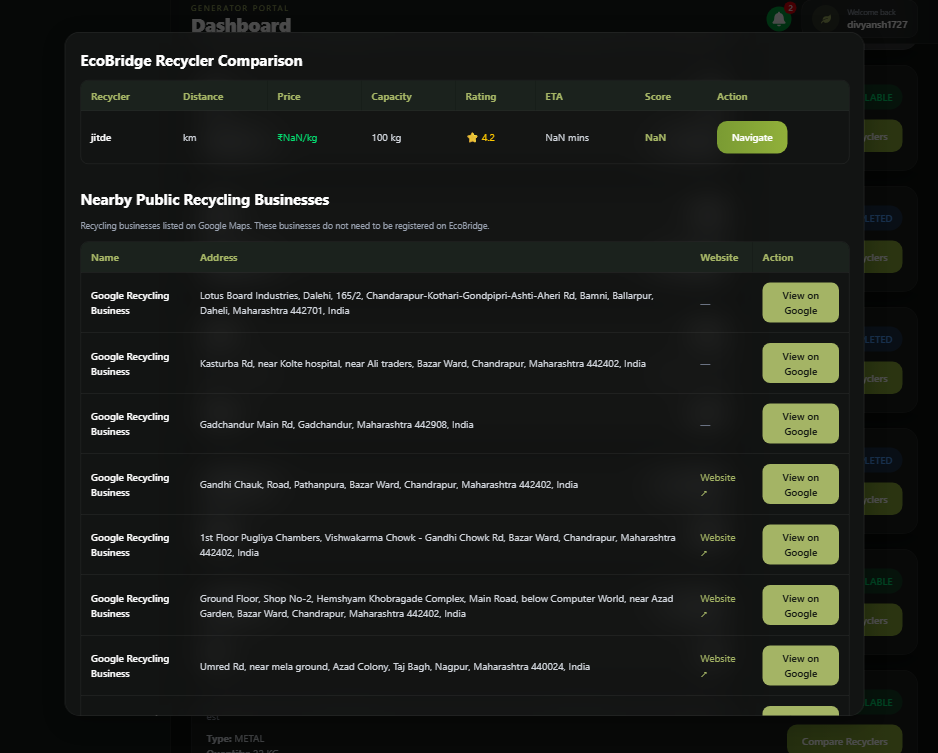 |

### ♻️ Recycler Experience


| Browse Waste | Reserve Waste |
|---|---|
|  |  |

| Complete Waste |
|---|
|  |

### 👤 Profile & Authentication

| Profile | OAuth |
|---|---|
|  | 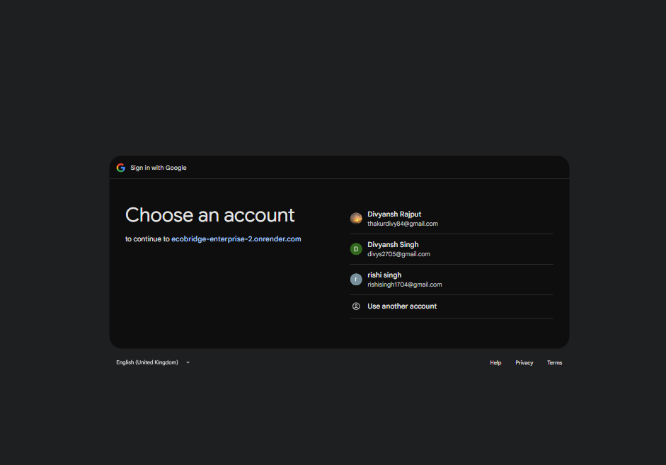 |

### 🔔 Notifications


### 📨 Kafka

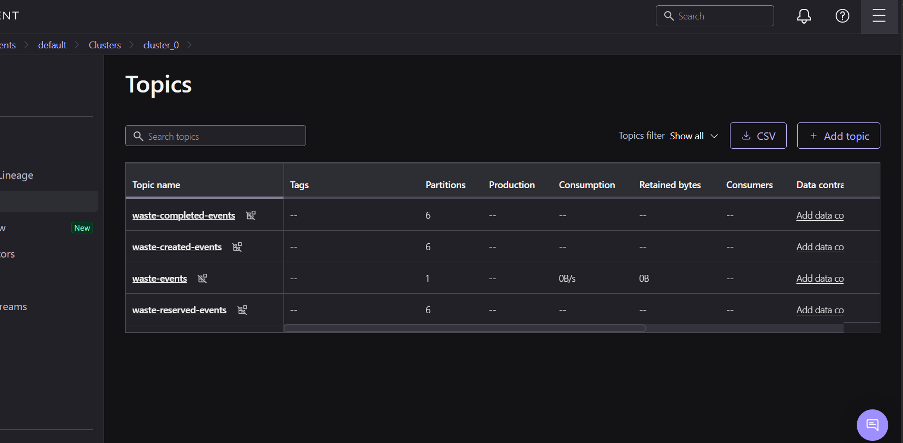

---

## 🗺️ Interactive Recycler Map

EcoBridge provides an interactive map that allows waste generators to
visualize nearby recycling options directly around the waste pickup location.

The map combines recycler information from multiple sources and visually
separates them using different markers.

### 📍 Map Overview

The waste pickup location is used as the center of the discovery process.
Nearby locations are then displayed on the Google Map.

```text
                    Google Map
                        │
          ┌─────────────┼─────────────┐
          │             │             │
          ▼             ▼             ▼
      🔴 Waste      🟢 EcoBridge    🟠 Google
       Location       Recycler       Business
          │             │             │
          └─────────────┼─────────────┘
                        │
                        ▼
                 Recycler Details
```


---

# ☸ DevOps Architecture

### Docker

```
                     Docker
                       │
                       ▼
                EcoBridge Network
                       │
                       ▼
                 Config Server
                    :8888
                       │
                       ▼
               Discovery Server
                    :8761
                       │
                       ▼
                 API Gateway
                    :8080
                       │
         ┌─────────────┼─────────────┐
         │             │             │
         ▼             ▼             ▼
    Auth Service   Waste Service   Recycler
       :8081          :8084         :8085
         │             │             │
         └─────────────┼─────────────┘
                       │
                       ▼
                Matching Service
                    :8086
                       │
                       ▼
             Analytics / Notification
```

### Kubernetes

```
                   Kubernetes
                       │
                       ▼
                EcoBridge Namespace
                       │
                       ▼
                  API Gateway
                       │
         ┌─────────────┼─────────────┐
         │             │             │
         ▼             ▼             ▼
    Auth Service   Waste Service   Recycler
         │             │             │
         └─────────────┼─────────────┘
                       │
                       ▼
                Matching Service
                       │
            ┌──────────┴──────────┐
            │                     │
            ▼                     ▼
      Notification            Analytics
            │                     │
            └──────────┬──────────┘
                       │
            ┌──────────┴──────────┐
            │                     │
            ▼                     ▼
          Redis                 Kafka
                       │
                       ▼
                   PostgreSQL
```

### 🔄 CI/CD

```
Developer
    │
    ▼
Git Push
    │
    ▼
GitHub
    │
    ▼
GitHub Actions
    │
    ├──────► Build
    │
    ├──────► Test
    │
    └──────► Docker Build
                 │
                 ▼
             Docker Image
                 │
                 ▼
             Deployment
                 │
          ┌──────┴──────┐
          │             │
          ▼             ▼
        Render      Kubernetes
```

### 📈 Monitoring

```
             EcoBridge Services
                     │
                     ▼
            Spring Boot Actuator
                     │
                     ▼
                Prometheus
                     │
                     ▼
                 Grafana
                     │
          ┌──────────┴──────────┐
          │                     │
          ▼                     ▼
    Service Metrics       System Metrics
```

# ☸ DevOps

EcoBridge Enterprise uses Docker, Kubernetes and GitHub Actions for containerization, orchestration and CI/CD.

### 🐳 Docker

| Docker Images | Docker Hub |
|---|---|
|  |  |

### ⚙️ CI/CD & Service Discovery

| GitHub Actions | Eureka Dashboard |
|---|---|
|  |  |

### ☸ Kubernetes

| Kubernetes Dashboard | Kubernetes Pods |
|---|---|
|  |  |

### 💻 Kubectl


---

# 📊 Monitoring

EcoBridge uses Prometheus and Grafana for application and infrastructure monitoring.

### 📈 Grafana

| Grafana Authentication | Grafana Metrics |
|---|---|
|  | 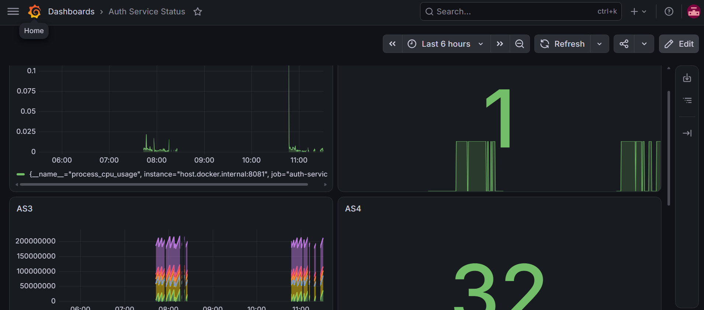 |


### 🖥️ CPU Metrics


### 🔥 Prometheus


---

# 📘 Interactive API Documentation

EcoBridge exposes its backend through multiple Spring Boot microservices.
Each service provides its own Swagger/OpenAPI interface, making it easy to
explore endpoints, inspect request/response models and test APIs independently.

The following screenshots show the Swagger documentation available across the
core EcoBridge services.

---

### 🔐 Auth Service

Handles authentication, JWT-based security, OAuth2 login and user-related operations.

**Swagger:**  
https://ecobridge-enterprise-2.onrender.com/swagger-ui/index.html


---

### ♻️ Waste Service

Manages waste creation, updates, availability, reservations and pickup-related
operations for waste generators.

**Swagger:**  
https://ecobridge-enterprise-3.onrender.com/swagger-ui/index.html

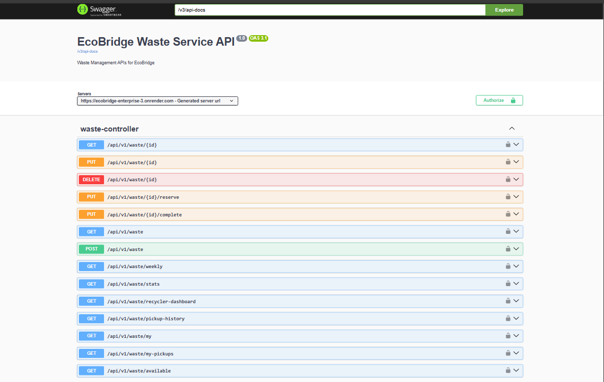

---

### 🏭 Recycler Service

Handles recycler registration, recycler profiles, accepted waste types,
capacity management and recycler discovery.

**Swagger:**  
https://ecobridge-enterprise-4.onrender.com/swagger-ui/index.html

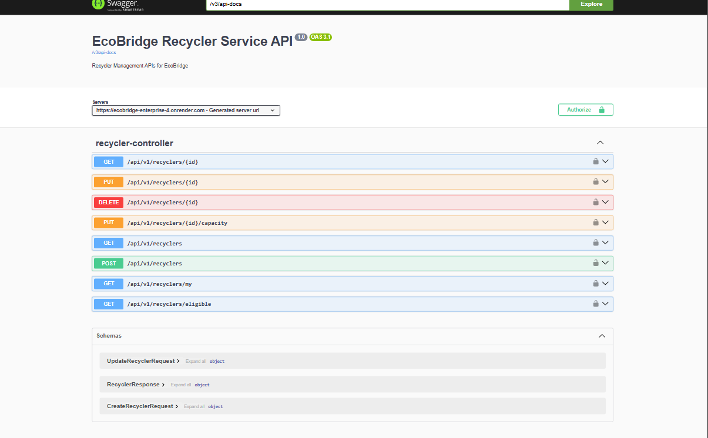

---

### 🎯 Matching Service

Provides the intelligent matching layer that connects waste with suitable
recyclers based on location, availability and matching criteria.

It also integrates recycler discovery from EcoBridge's registered recyclers
along with external location sources such as Google Places and OpenStreetMap.

**Swagger:**  
https://ecobridge-enterprise-6.onrender.com/swagger-ui/index.html

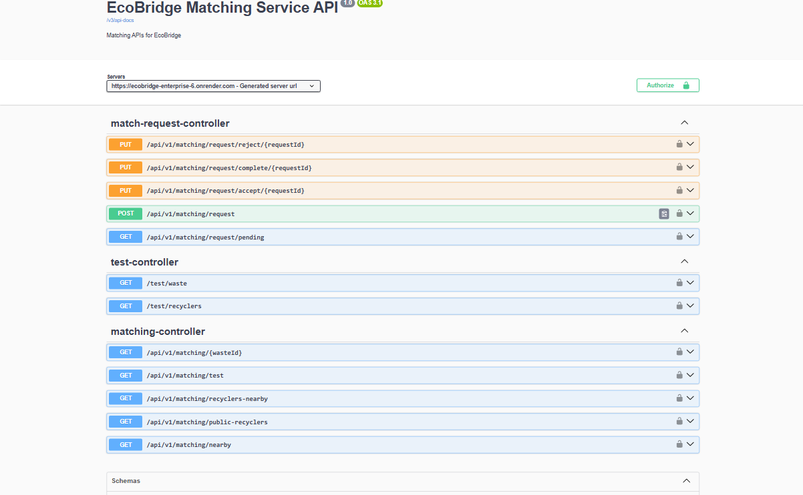

---

### 🔔 Notification Service

Handles application notifications and event-driven communication between
the platform's services.

**Swagger:**  
https://ecobridge-enterprise-5.onrender.com/swagger-ui/index.html

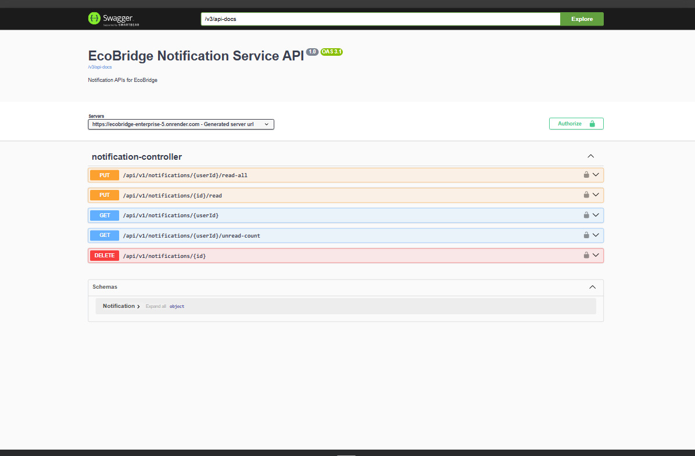

---

### 📊 Analytics Service

Provides analytics and operational insights generated from activity across
the EcoBridge platform.

**Swagger:**  
https://ecobridge-enterprise-7.onrender.com/swagger-ui/index.html

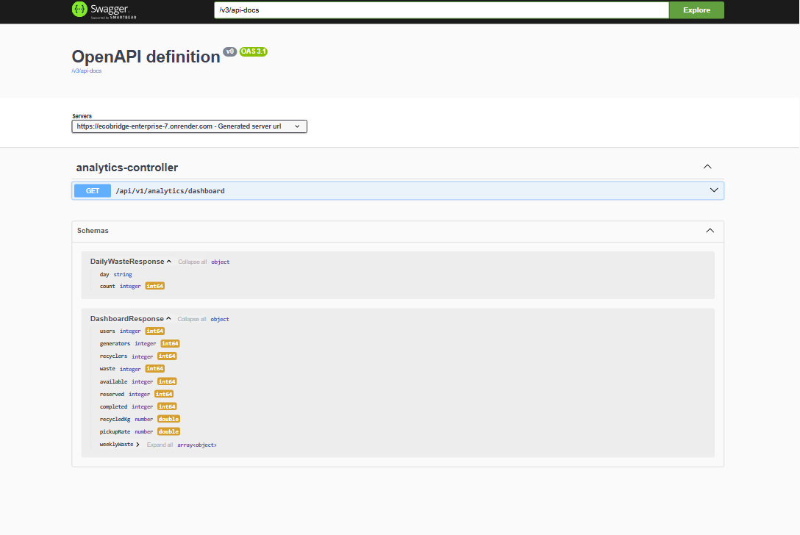

---

### 🚪 API Gateway

The API Gateway acts as the public entry point for the deployed backend
architecture and routes requests to the appropriate microservice.

**Gateway:**  
https://ecobridge-enterprise-0.onrender.com

---

## 🛠 Technology Stack

| Layer | Technologies |
|---|---|
| Frontend | React, Vite, Tailwind CSS, Axios |
| Authentication | Spring Security, JWT, OAuth2 |
| Backend | Spring Boot |
| Microservices | Spring Cloud |
| API Gateway | Spring Cloud Gateway |
| Configuration | Spring Cloud Config Server |
| Service Discovery | Eureka |
| Service Communication | OpenFeign |
| Database | PostgreSQL |
| Caching | Redis |
| Event Streaming | Apache Kafka |
| Maps | Google Maps |
| Places Discovery | Google Places API |
| Public Location Data | OpenStreetMap, Overpass API |
| Monitoring | Prometheus, Grafana, Spring Boot Actuator |
| Containerization | Docker, Docker Compose |
| Orchestration | Kubernetes |
| CI/CD | GitHub Actions |
| Backend Deployment | Render |
| Frontend Deployment | Vercel |

---

## 📁 Project Structure

```
EcoBridge-Enterprise
│
├── backend/
│   │
│   ├── api-gateway/
│   ├── auth-service/
│   ├── config-server/
│   ├── discovery-server/
│   ├── waste-service/
│   ├── recycler-service/
│   ├── matching-service/
│   ├── notification-service/
│   └── analytics-service/
│
├── frontend/
│
├── infrastructure/
│   │
│   ├── docker/
│   └── kubernetes/
│
├── docs/
│   ├── api.md
│   ├── architecture.md
│   ├── workflow.md
│   ├── deployment.md
│   ├── observability.md
│   ├── swagger.md
│   └── maps.md
│
└── README.md
```

---

## 🔮 Future Enhancements

- AI-powered waste classification
- Push notifications
- Live recycler tracking
- Real-time pickup tracking
- Advanced recycler recommendations
- Mobile application
- Multi-language support
- Expanded analytics
- Automated waste image classification
- More external recycling data sources

---

## 👨‍💻 Author

**Divyansh Singh**

- 🌐 GitHub: [divyansh1727](https://github.com/divyansh1727)
- 💼 LinkedIn: [divyansh1727](https://www.linkedin.com/in/divyansh1727/)
- 📧 Email: divys2705@gmail.com

---

## ⭐ Project

EcoBridge Enterprise demonstrates the design and deployment of a production-oriented microservices platform combining:

**Spring Boot + Spring Cloud + React + PostgreSQL + Redis + Kafka + Docker + Kubernetes + Google Maps + Google Places + OpenStreetMap + Prometheus + Grafana + GitHub Actions.**